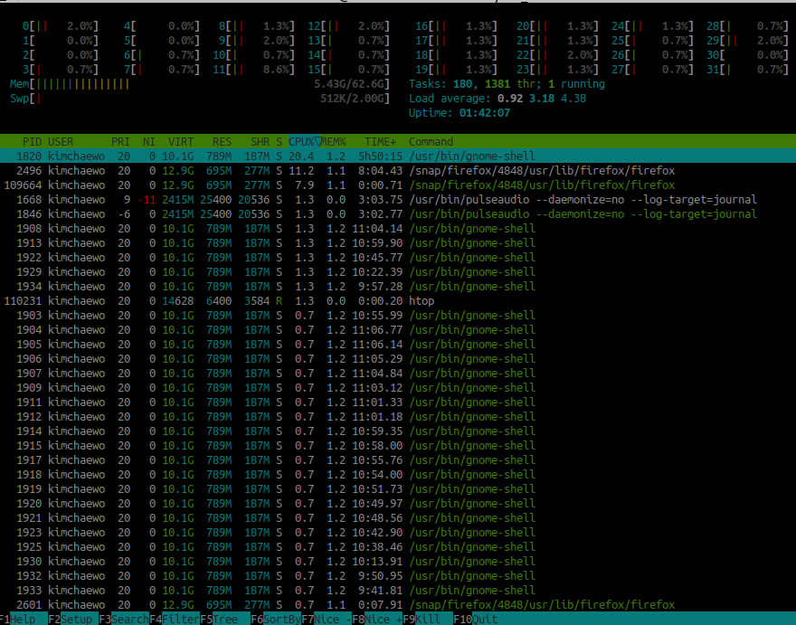
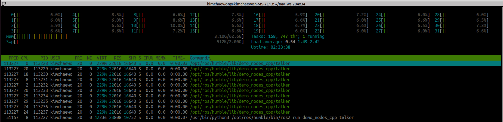

아래의 명령어를 통해 성능을 분석해보자. 
```
htop 
```

실험환경 조성
1. vscode와 terminator를 제외한 모든 창은 꺼주기 (아니 여기 타자치는 순간에도 코어가 급발진을...;;)
2. 일을 시켰을 때 코어와 메모리, 스레드가 어떻게 동작하는지 관찰하기 
3. 작은 일부터 큰 일 순으로 테스트 진행 


## 아무것도 실행하지 않았을 때의 모습 

Linux OS 자체가 기본적으로 점유하고 있는 자원

1. CPU 영역 
   1. 주요 점유 프로세스 
      1. gnome-shell(CPU 20.4%, MEM 1.2%)
      2. firefox(CPU 11.2%, MEM 1.1%)
         1. 브라우저 적당히 열어야겠다. 
         2. 새로고침할 때 코어 사용량 잠깐 올라갓다 내려감(대략 10% 정도)
2. 메모리
   1. 전체 62.6G에서 5.31G 사용중 -> 나중에 이값 빼야 실제 애플리케이션 순수 메모리량 알 듯 하다. 
   2. fireFox 창 두개 끄니까 4.78까지 떨어짐 

```
 task: 175, 1230 thr;
 1 running 
```
현재 메모리에 로드되어있는 독립적인 프로세스 175개
175개의 프로세스 내에 총 1230개의 스레드 쪼개서 운영중 

ros2는 통신을 위해 기본적으로 스레드를 많이 생성하므로 thr가 많음 

전체 1230개의 스레드 중 1ms에 실제로 cpu코어를 붙잡고 계산하는 스레드 수는 1개 


----
다시 test 진행
이번에는 위의 실험환경대로 세팅 후 진행 
아무것도 실행을 하지 않고 vscode와 terminaotr 화면 3개를 띄우고 있을 때 코어는 다음과 같은 모습을 보였음 
![alt text][nothing2_exe]


cpu core 사용량이 1%에 근접중임
메모리 사용량은 3.17G/62.6G


Tasks: 156, 739 thr;
1 running
=> 멀티 스레드 진행 중 


## Talker와 Listener의 자원 사용량 살펴보기 

```
ros2 run demo_nodes_cpp talker
ros2 run demo_nodes_py listener
```

case. talker 


해설 
1. CPU 영역 
   1. 32개의 코어가 멀티프로세싱 중
      현재 모든 코어가 8~14% 정도 골구로 일하는 중 
   2. 이는 운영체제가 여러 코어에 부하를 분산시켜 관리하고 있음을 의미 
2. 메모리 및 부하 
   1. Mem

case. listener 


Talker의 경우 cpu와 mem 사용량이 0.0%로 찍히며 가끔 cpu 가 0.7%를 찍는다. 
Listener의 경우 mem이 0.1%fmf Wlrrh dlTek. 

0.0%는 값이 너무 작아서 반올림된 결과값이므로 mem%말고 RES를 한번 확인해보자. 

[nothing_exe]: image.png


