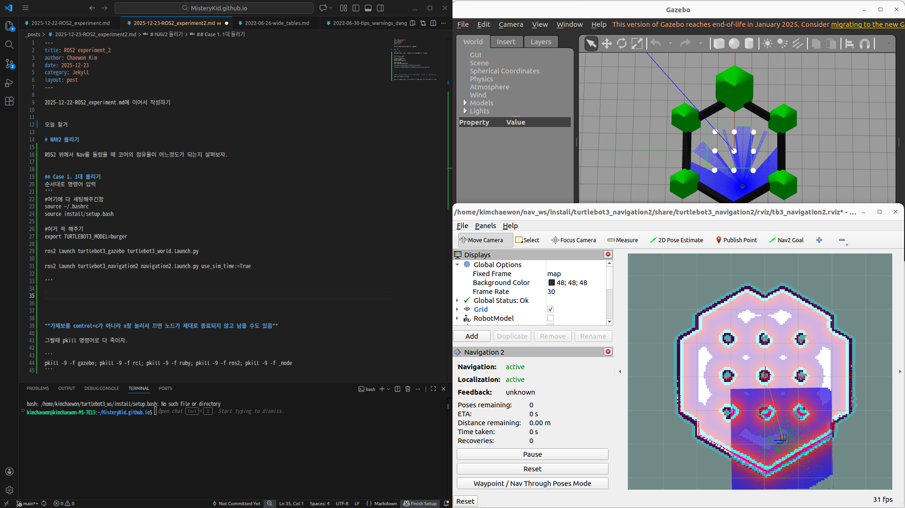
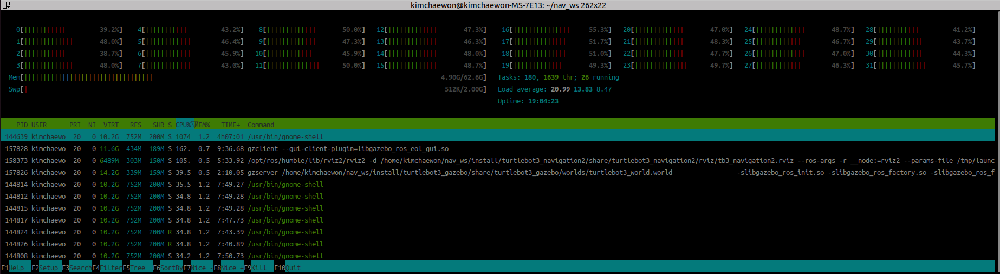

2025-12-22-ROS2_experiment.md에 이어서 작성하기 


오늘 할거 

# NAV2 돌리기 

ROS2 위에서 Nav를 돌렸을 때 코어의 점유율이 어느정도가 되는지 살펴보자. 

Nav2란?
주변 환경을 '행렬(Costmap)'로 정의하고, 내 위치를 '행렬 곱(TF)'으로 계산하며, 최적의 이동 방향을 '행렬 방정식(Control)'으로 풀어내는 알고리즘 집합체


## Case 1. 1대 돌리기
순서대로 명령어 입력 
'''
#여기에 다 세팅해주긴함 
source ~/.bashrc 
source install/setup.bash

#이거 꼭 해주기 
export TURTLEBOT3_MODEL=burger

#거북이 모양 지도 키우기 
ros2 launch turtlebot3_gazebo turtlebot3_world.launch.py

ros2 launch turtlebot3_navigation2 navigation2.launch.py use_sim_time:=True
#gazebo랑 timing 맞추기 위해 use_sim_time 꼭 true로 설정해주기 
'''

주요 노드 : planner_server, controller_server, bt_navigator, amcl

nav2연 후에 initializing 진행 


다음과 같이 화면 세팅 

반대편 화면에는 터미널 3개 띄워줌 
1. gazebo
2. nav2
3. htop
   



|상황   |:-:|   코어 할당량 평균(일단 눈대중으로)| tasks | thr |
|기본   |:=:|   34 ~ 45% |
|init   |:-:|   | 175 | 1610 |
|nav2   |:-:|   37 ~50% |   175 |1611 |

Nav2에서 goal을 설정하는 순간 cpu 점유율이 올라갔다가 다시 내련다. 

init 할 때 코어 할당량이 크게 변화하지 않음 

Nav2를 1대 돌릴때에는 행렬 연산보다 랜더링 부하가 더 크게 보여짐 

아무래도 32코어 시스템에서 ros2가 코어별로 작업을 잘 분산하는 스케쥴링을 짜놔서 부하가 크게 안느껴지는 것으로 보임 

반면 Gazebo는 모니터 화면에 그래픽을 띄우는 I/O연산을 진행하므로 더 많은 자원을 소모


**테스트하기에 지도가 너무 작음, 다른 지도를 불러와보자.**


```
ros2 launch turtlebot3_gazebo turtlebot3_house.launch.py

```


**가제보를 control+c가 아니라 x창 눌러서 끄면 노드가 제대로 종료되지 않고 남을 수도 있음**

그럴때 pkill 명령어로 다 죽이자. 

```
pkill -9 -f gazebo; pkill -9 -f rcl; pkill -9 -f ruby; pkill -9 -f ros2; pkill -9 -f _node
```

# SLAM

SLAM은 Simultanious and Localization 

1. Cartographer