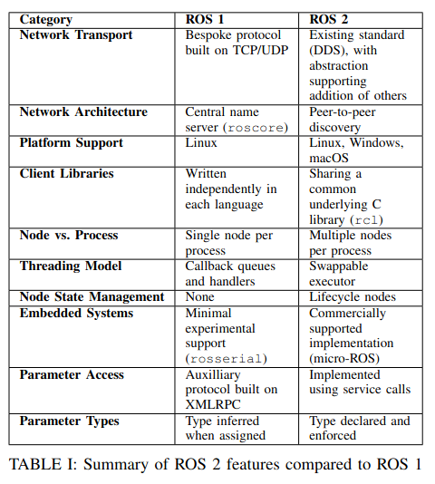
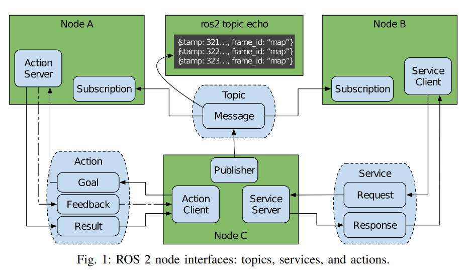

20분 발표

1차 정리 : 2025-12-24 (수)

**Review article이란**

a journal article that summarizes the current state of understanding on a topic within a certain discipline

generally considered a secondary source since it may analyze and discuss the method and conclusions in previously published studies.

출처 : https://en.wikipedia.org/wiki/Review_article 

a survey of previously published research on a topic.

give an overview of current thinking on the topic

it provide a comprehensive foundation on a topic 

출처 : https://authorservices.taylorandfrancis.com/publishing-your-research/writing-your-paper/how-to-write-review-article/ 

본 논문은 리뷰 논문으로 ROS2에 대한 최신 로봇 시스템을 확립하고 이것을 성공시킨 기술과 철학적 변화를 보여준다. 
또, ros2가 특정 환경에서 자동화 시스템에 어떻게 영향을 주었는지 입증하기 위해 산업분야까지 확장할 것이다. 

-> 해당 논문은 ROS2에 대한 배경 지식을 확립할 수 있도록 도와주는 리뷰 논문이다. 구글링으로 흩어져있는 정보를 찾는 대신 이걸로 ROS2에 대한 개념을 꽉 잡아두자. 

**Related Work이란**
자신의 논문이 다루는 주제에 대해 기존에 어떤 관련 연구들이 있었는지 설명하는부분 

**궁극적인 목적은 해당 논문에 대한 positioning이다.**

자신의 접근법이 기존 접근법들 중에서 어디에 위치하는지에 대해 positioning 뿐만 아니라 자신의 연구가 어떤 의미를 가지고 있으며 어떤 문제를 풀려고 하는건지, 그리고 왜 중요한지를 그 분야의 관련 연구 흐름속에서 위치시키는것 

1. YARP

focused on humanoid and legged robotics

2. LCM (Lightweigh Communications and Marshalling)

handling messageing and data marshalling in high bandwidth low latency env

3. OROCOS (Open Robot Control Software)

focused on real time control system and related topics, such as computing Kinematic chains and Bayesian filtering 

4. CORBA

for deterministic computagion in real-time application

5. ROS1

has large ecosystem of sensor, control, and algorithmic packages made available by community contributions, enableing a small team to build complex robotics application 

solves may of the complexity issues interent to robotics

## ROS2

a software platform for developing robotics applications, also known as a robotics software development kit. 

open source 

divided into **three category**

1. Middleware
2. Algorithms
3. Developer tools

### Design Principles

**Distribution**

Requirements are separated into functionally independent componets

These messages define the semantics of the data excahnged.

**Abstraction**

interface specifications must be establish.

balancing

*the benefits of exposing the details of comonent*  **vs**  *costs of overfiting the rest of the applicatoin to that component*

*내용을 너무 많이 보여주면 성능은 좋아져도 종속성 문제가 생김* **vs** *내용을 너무 숨기면 범용성은 좋아지지만 성능이나 세부 조절이 어려움 *

둘 사이의 균형을 적절하게 조절해야 바람직한 추상화 이루어짐

**Asynchrony(비동기)**

The messages defined are communicated among the components asynchronously, creating an **event-based system**

can make it moer difficult to achieve deterministic execution 

**Modularity**

**Make each program do one thing well** is mirrored

### Design Requirements

**Security**

Any software that interacts with a network must include features to secure that interaction against aaccidental and malicious misuse.

**Embedded systems**

A full ROS2 stack is not expected to run on small embedded devices

though ROS2 should facilitate and standardize intergration of CPUs and micro controllers.

*Micro_ROS* allows ROS2 to be reused on embedded system

**Diverse networks**

ROS2 provides quality of service that configures how data flow through the system

**Real time computing**

Some parts of a system must execute in deterministic amounts of time. 

**Product readness**

lab -> commercial use : new constrains are introduced

### Communications Patterns

1. Topic 
   1. asynchronous message 
   2. ROS2 provides the same publish-subscribe functionality

2. Services
   1. request-response style pattern

3. Actions
   1. A uniqe communication pattern
   2. goal-oriented and asynchronous communication interfaces with a request, response, periodic feedback, and the ability to be cancled 

### Middleware Architecture

