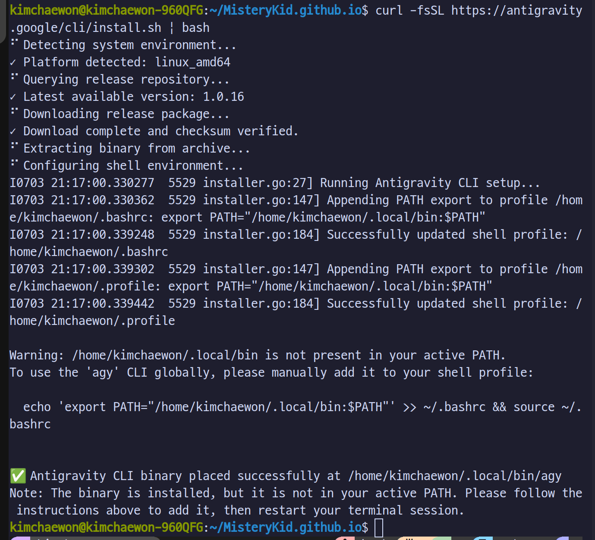
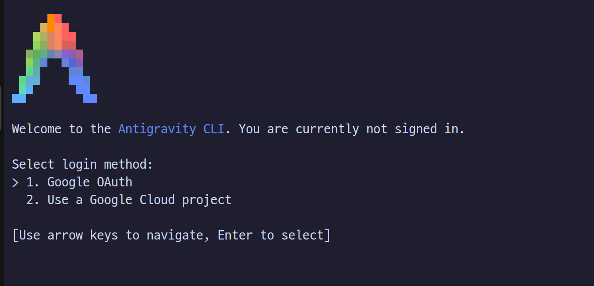
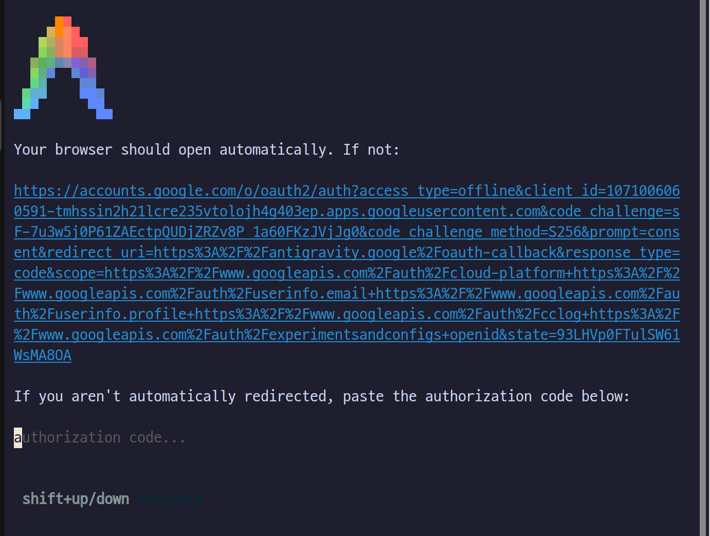
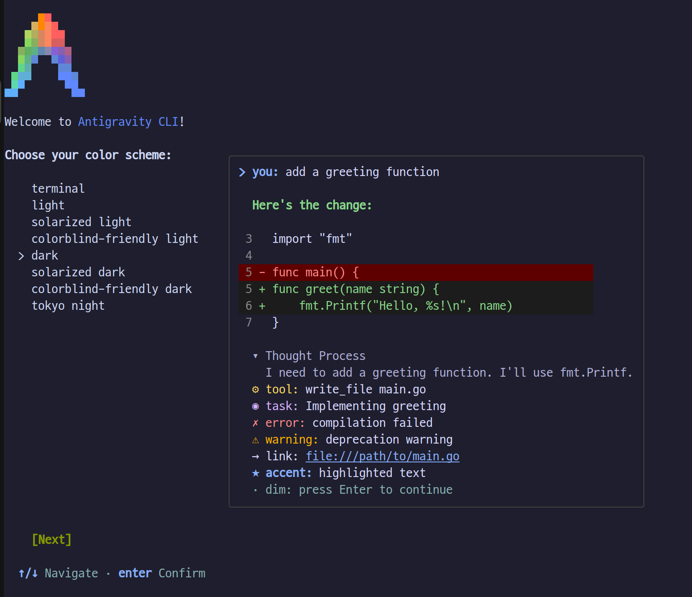
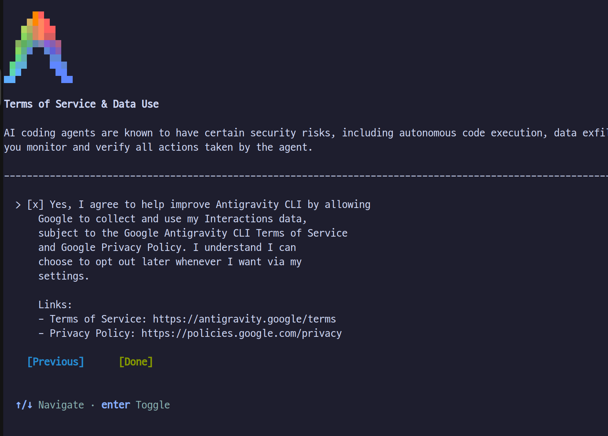
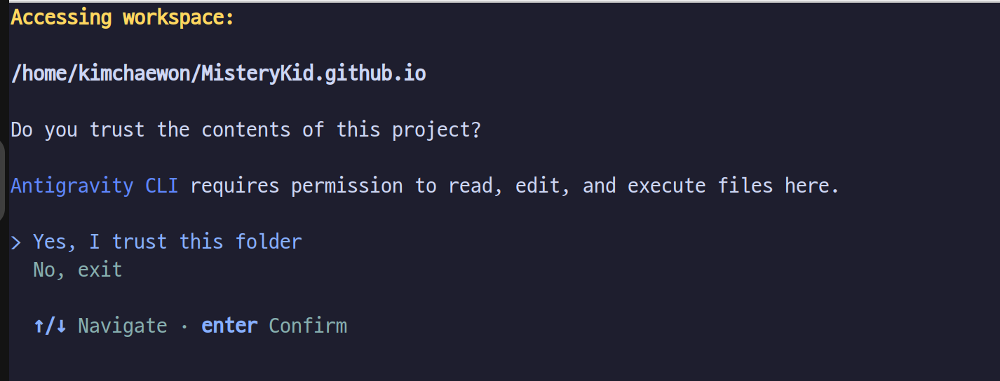
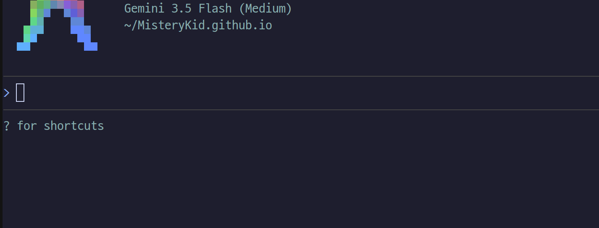

안티그래비티(Antigravity) CLI 설치 및 기본 세팅 과정을 정리한다. 아래의 단계별 설명을 따라하면 누구나 쉽고 빠르게 CLI 환경을 구축할 수 있다.

---

### 1. 설치 스크립트 실행
터미널을 열고 아래 명령어를 입력하여 안티그래비티 CLI 설치 스크립트를 다운로드하고 실행한다.
```shell
curl -fsSL https://antigravity.google/cli/install.sh | bash
```



---

### 2. 환경 변수(PATH) 설정
설치가 완료되면 터미널 어디에서나 `agy` 명령어를 사용할 수 있도록 실행 파일 경로를 환경 변수에 추가해야 한다. 아래 명령어를 실행하여 설정을 추가하고 바로 반영한다.
```shell
echo 'export PATH="/home/kimchaewon/.local/bin:$PATH"' >> ~/.bashrc && source ~/.bashrc
```

---

### 3. 안티그래비티 실행
환경 변수 설정이 완료되었다면 다음 명령어를 입력하여 안티그래비티를 실행한다.
```shell
agy
```



---

### 4. 웹사이트 인증
화면에 나타나는 안내를 따라 인증 사이트에 접속한 후, 발급된 코드를 복사하여 입력란에 붙여넣는다.


---

### 5. 테마 설정
본인의 선호에 맞는 테마를 선택하고 다음 단계로 진행한다.


---

### 6. 설정 완료 및 작업 폴더 신뢰
설정 확인 화면이 나오면 `OK` 버튼을 클릭한다.


작업할 폴더를 신뢰할 것인지 묻는 경고창이 나타나면 신뢰(Trust)를 선택한다.


---

### 7. 설치 완료 및 사용
모든 세팅이 정상적으로 마무리되었다. 이제 안티그래비티 CLI를 사용하여 코딩 작업을 시작한다.
