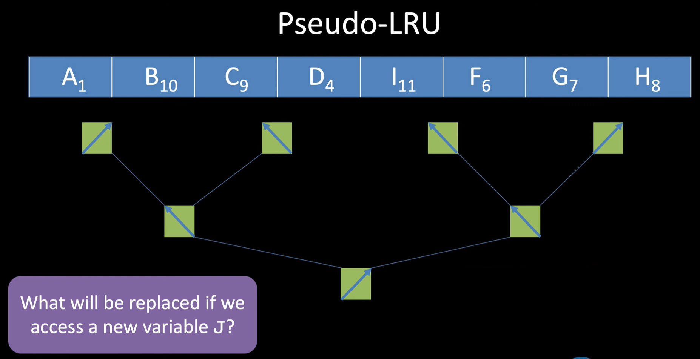
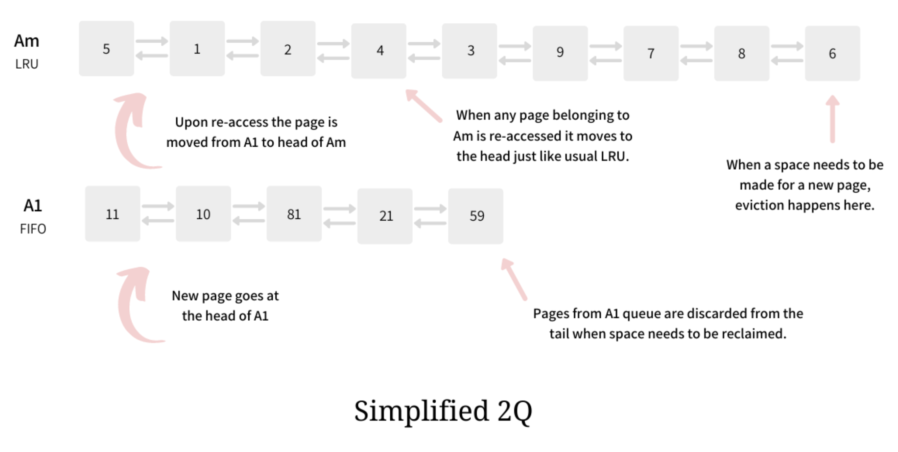

## Eviction Algorithm이란?

캐시는 결국 메모리이므로 공간이 제한되어있다. 

이러한 캐시는 언젠가는 새로운 데이터를 넣을 공간이 부족하게 되고 이러한 부족한 공간을 확보하기 위해서 기존의 데이터를 버리게 된다. 

이때 어떤 데이터를 버릴지를 결정하는 정책을 Cache Eviction Policies 라고 한다. 

## Algorithm 종류 
지금까지는 LRU 정책만 알고 있었는데 이번 논문 세미나에서 굉장히 다양한 algorithm이 있다는걸 알게 되어서 이렇게 한번 정리해본다. 

---

### Belady's Algorithm 

앞으로 가장 오랫동안 사용되지 않을 데이터를 예측해서 쫒아내자. 

- LRU : 과거를 관측하고 가장 오랫동안 안 쓰인 것을 교체
- Belady : 미래를 보고 가장 나중에 쓰이거나 아예 안 쓰일 것을 교체 

미래는 알 수 없으므로 실무에서 실제로 구현할 수 없는 알고리즘임

하지만 가장 이상적인 eviction algorithm이므로 이와 유사하게 작동하도록 정책을 설계하는 것이 최종 목표가 됨 

---
**내용물의 history를 참고하지 않는 정책**

### FIFO (First In First Out)
가장 간단한 형태의 정책 

### RR (Random Replacement)
랜덤으로 쫒아낼 데이터를 택하는 정책

---

### LRU (Least Recently Used)
가장 널리 사용되고 있는 알고리즘

데이터의 history를 추적해서 가장 오랫동안 사용되지 않은 데이터를 버리는 정책

왜이렇게 많이 사용될까?
- Temporal Locality : Once data is requested, it will be requested again soon !!
- 한번 사용된 데이터는 나중에 또 사용될 가능성이 높다. 

대부분의 프로그램에서 잘 돌아가지만 항상 best는 아니다.

aging bits를 통해 구현 
- Need to store the complete order in which blocks accessed

하지만 캐시에 접근이 일어날 때 마다, 코든 캐시 라인의 aging bits 상태가 매번 바뀌므로 비용이 비싸다.

그 외의 한계점이 존재하고 있다고 함
- disk-backed database에 있는 캐시 관리에 부적절

### PLRU (Psudo LRU)
LRU랑은 비슷하지만 age를 approximate하게 계산

정확하지는 않지만 충분히 old한 데이터 찾기 

두가지 방법으로 구현 가능
1. Tree-PLRU
    - https://www.youtube.com/watch?v=0qBrbVAJbfc
    - 이진 탐색 트리를 구축
    - 각 노드는 Flag 비트 포함
    - 동작 과정
        가장 최근에 접근된 캐시 방향으로 화살표 설정
        화살표와 반대되는 방향으로 가면 가장 오랫동안 접근되지 않았다고 추정되는 캐시 발견

화살표 방향이 최근데 접근된 데이터를 표시함

그래서 화살표 반대방향을 따라가게 되면 꽤 오랫동안 쓰이지 않은 데이터를 찾을 수 있게됨 

2. Bit-PLRU
    - 각 캐시 라인마다 MRU 비트라고 불리는 1비트짜리 표시 유지 
    - 이 비트를 MRU 비트라고 함
    1. 처음에는 모두 0으로 초기화
    2. 접근이 일어나면 1로 변경
    3. 캐시 미스 발생 시, 비트가 0인 가장 왼쪽 얘를 버림
    4. 모든 라인이 1이 되면 다시 모든 비트를 0으로 초기화 

### Two Queue

두 개의 분리된 큐를 사용해서 캐시 오염을 방지하는 알고리즘
1. FIFO 큐
2. LRU 큐

2Q : A Low Overhead High Performance Buffer Management Replacement Algorithm 에서 처음 제안

Question : 캐시 오염이 왜 발생하는거지?

여기서 말하는 Pollution은 데이터가 변경된다는 뜻이 아니라 필요없는 데이터로 가득 차서, 정작 많이 사용되는 데이터가 다 쫒겨난 상태를 의미함

그럼 왜 LRU에서 오염이 발생한다는 언급이 나온다는걸까?

LRU는 자주가 아닌, 최근에 사용되었는지에 대한 것만을 신경을 씀 (Temporal locality를 바탕으로 둠)

근데 이러한 locality가 적용되지 않는 경우에 오염이 발생할 수 있음

LRU 오염 시나리오
1. 기존 캐시에는 자주 사용되는 데이터가 잘 들어있었음
2. 딱 한번 읽으면 되는 데이터가 대량으로 들어오게 됨
3. 기존에 계속 Hit되고 있던 데이터가 캐시에서 밀려나게되
4. 새로 채워진 얘들은 이젠 사용되지 않을 데이터라 필요없어짐

결국 그냥 캐시가 초기화 되는 효과가 얻게 됨

이걸 해결하고자 2Q 제안됨
- 한번 읽은건 임시 큐(AI)에 넣어두고
- 거기 남아서 2번 이상 읽힌 얘들은 두번째 큐(AM)에 넣어주자 

https://arpitbhayani.me/blogs/2q-cache/

2Q Full Version 도 있는데 이건 나중에 더 알아보자. 

오늘은 간단하게 훑는 느낌으로. 

### ARC (Adaptive Replacement Cache)

워크로드의 특성을 실시간으로 모습을 바꾸며 스스로 학습하는 캐시 정책 

프로그램의 성격에 따라 어떨떄는 LRU가, 어떨때는 LFU가 유리

또 하나의 프로그램도 낮/밤에 따라 접근 패턴이 계쏙 바뀜

### LeCaR (Learning Cache Replacement)

